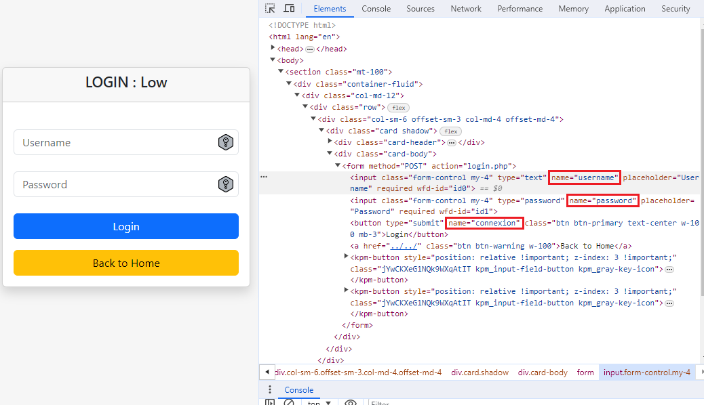
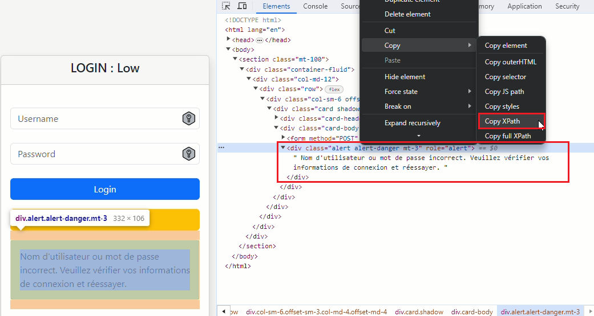
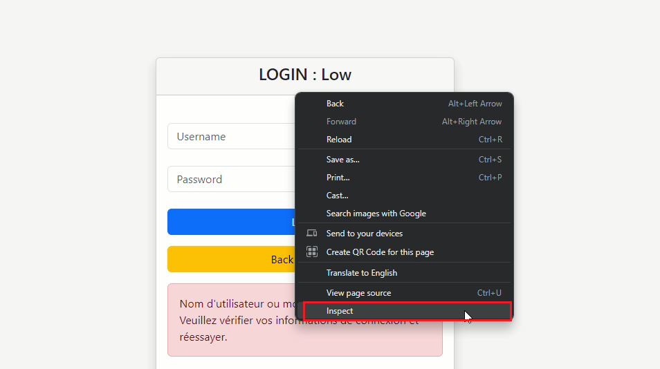
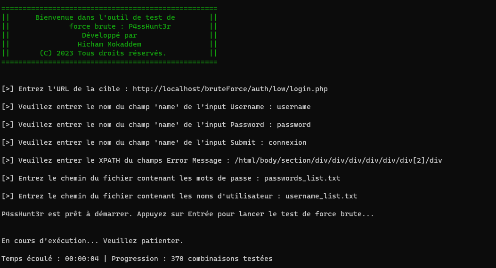
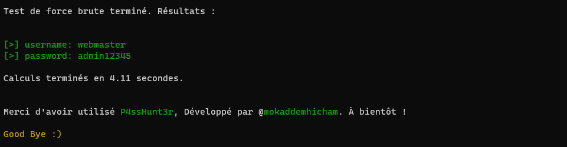

# Guide d'Utilisation de l'Outil de Force Brute **P4ssHunt3r**

Bienvenue dans cet outil de test de force brute *P4ssHunt3r*. Cet outil a été créé à des fins éducatives uniquement, dans le but de sensibiliser à la sécurité informatique et à la nécessité de mettre en place des mesures de protection adéquates.

**Note importante :** L'utilisation de cet outil sur des systèmes sans autorisation explicite est illégale et contraire à l'éthique. Assurez-vous d'obtenir les autorisations nécessaires avant d'utiliser cet outil.

## Prérequis

Avant de commencer, assurez-vous de disposer des éléments suivants :

1. **Python installé sur votre système :**

   - Sur Linux :
     ```bash
     sudo apt-get update
     sudo apt-get install python3
     ```
   - Sur Windows : Téléchargez et installez Python depuis [le site officiel](https://www.python.org/downloads/). Assurez-vous de cocher l'option "Add Python to PATH" lors de l'installation.

2. **Bibliothèques Python nécessaires installées :**

    ```bash
    pip install -r requirements.txt
    ```
     Assurez-vous d'avoir le fichier requirements.txt dans le même répertoire que votre script.

# Obtention des Attributs 'name' depuis la Page de Connexion

Avant de lancer l'outil, vous devez déterminer les noms des champs 'name' pour le nom d'utilisateur, le mot de passe et le bouton de connexion sur la page de connexion cible.

1. **Inspectez la Page de Connexion :**
   - Ouvrez la page de connexion dans un navigateur web.
   - Cliquez avec le bouton droit sur le champ du nom d'utilisateur et sélectionnez "Inspecter" dans le menu contextuel.

2. **Trouvez l'Attribut 'name' :**
   - Dans l'inspecteur d'éléments, recherchez l'attribut 'name' du champ du nom d'utilisateur. Notez ce nom.
   

3. **Répétez pour le Mot de Passe et le Bouton :**
   - Répétez les étapes ci-dessus pour trouver les attributs 'name' du champ du mot de passe et du bouton de connexion.

4. **Notez les Noms des Champs 'name' :**
   - Notez les noms des champs 'name' que vous avez obtenus. Vous en aurez besoin lors de l'exécution de l'outil.

# Obtention du XPath du Message d'Erreur

Pour déterminer le XPath du message d'erreur en entrant des données incorrectes, suivez ces étapes :

1. **Entrez des Données Incorrectes :**
   - Sur la page de connexion, entrez délibérément des données incorrectes (nom d'utilisateur et/ou mot de passe) et soumettez le formulaire.

2. **Inspectez le Message d'Erreur :**
   - Utilisez l'inspecteur d'éléments pour sélectionner le message d'erreur affiché après la soumission incorrecte du formulaire.
   

3. **Obtenez le XPath :**
   - Cliquez avec le bouton droit sur l'élément du message d'erreur, sélectionnez "Copy" dans le menu contextuel, puis choisissez "Copy XPath".
   

4. **Notez le XPath du Message d'Erreur :**
   - Notez le XPath que vous avez copié. Vous en aurez besoin pour configurer la détection de la validité des identifiants dans le script.
  
# Guide d'Utilisation du Script

Maintenant que vous avez configuré l'environnement, suivez ces étapes pour utiliser le script de force brute.

1. **Clonez le Projet ( Si vous avez Git installé ):**
   ```bash
   git clone https://github.com/mokaddemhicham/passHunter.git
   ```
   Si vous n'avez pas Git installé, vous pouvez télécharger le projet au format ZIP en visitant le lien suivant dans votre navigateur web :[https://github.com/mokaddemhicham/passHunter/archive/main.zip](https://github.com/mokaddemhicham/passHunter/archive/main.zip)

2. **Naviguez vers le Répertoire :**
    ```bash
    cd passHunter
    ```
3. **Configurez l'Environnement :**
   - Assurez-vous que les fichiers de dictionnaires sont prêts.
5. **Lancez le Script :**
   ```bash
   python passHunter.py
   ```
6. **Suivez les Instructions :**
   - L'outil vous guidera pour saisir l'URL cible, les noms des champs d'entrée, et les fichiers de dictionnaires.
   
7. **Attendez le Résultat :**
   - L'outil exécutera l'attaque par force brute. Attendez la fin du processus.

8. **Consultez les Résultats :**
   - Les résultats de l'attaque seront affichés à la fin du processus.

# Gestion des Erreurs, Avertissements, etc.

En cas d'erreur ou de problème lors de l'utilisation de l'outil, veuillez prendre en compte les éléments suivants :

- **Fichiers Introuvables :**
    - Si le script signale l'absence de fichiers, assurez-vous que les fichiers spécifiés (dictionnaires, etc.) sont présents dans le répertoire spécifié.

- **Erreur dans les Instructions :**
    - Vérifiez attentivement que vous suivez correctement les instructions fournies par l'outil lors de son exécution.

- **Problèmes de Connexion :**
    - Assurez-vous que l'URL cible est correcte et que vous avez une connexion Internet stable.

En cas de problème persistant, consultez la documentation ou contactez l'auteur de l'outil pour obtenir de l'aide.

# Captures d'écran

